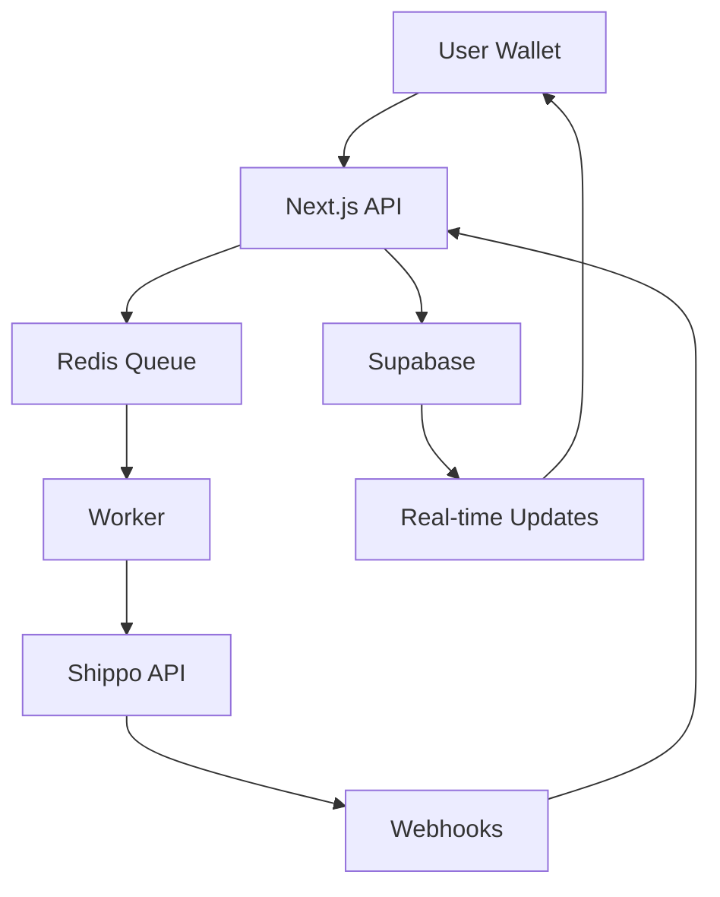

# ReFit Backend Architecture

## Overview

The ReFit backend provides a scalable, production-ready infrastructure for device buyback with integrated shipping and order management. It supports millions of users with real-time updates and secure wallet-based authentication.

## Architecture Components

### 1. Database (Supabase)

**Tables:**
- `users` - User accounts linked to Solana wallets
- `shipping_addresses` - Validated shipping addresses
- `orders` - Device buyback orders with pricing and status
- `order_status_history` - Audit trail of order status changes
- `shipping_events` - Tracking events from carrier webhooks
- `device_prices` - Cached device pricing data

**Features:**
- Row Level Security (RLS) for data isolation
- Real-time subscriptions for live updates
- Automatic timestamp management
- Postgres functions for order number generation

### 2. API Routes (Next.js)

**Endpoints:**
- `POST /api/shipping/validate-address` - Validates and saves shipping addresses
- `GET /api/shipping/rates` - Fetches shipping rates for orders
- `POST /api/orders/create` - Creates new device buyback orders
- `POST /api/webhooks/shippo` - Processes carrier tracking webhooks
- `GET /api/health` - Health check for monitoring

**Security:**
- JWT authentication via Supabase
- Webhook signature verification
- Input validation and sanitization
- Rate limiting (configurable)

### 3. Background Workers (BullMQ)

**Workers:**
- `label-purchase.worker.js` - Asynchronously purchases shipping labels

**Features:**
- Retry logic with exponential backoff
- Error handling and dead letter queues
- Job prioritization
- Scalable across multiple instances

### 4. Shipping Integration (Shippo)

**Capabilities:**
- Multi-carrier support (USPS, UPS, FedEx, etc.)
- Address validation
- Real-time rate shopping
- Label generation
- Tracking updates via webhooks

### 5. Services

**Production Services:**
- `shipping.production.js` - Shippo API integration
- `userProfile.production.js` - User and order management
- `supabase.js` - Database client and auth helpers

**Service Factory:**
- Seamless switching between mock and production services
- Feature flag support for gradual rollout

## Data Flow



## Key Features

### 1. Wallet-Based Authentication
- No passwords required
- Automatic user creation on first wallet connection
- Secure session management via Supabase JWT

### 2. Real-Time Updates
- Order status changes pushed instantly
- Shipment tracking events delivered live
- Powered by Supabase real-time subscriptions

### 3. Scalability
- Horizontal scaling of API and workers
- Database connection pooling
- Async job processing
- CDN-ready static assets

### 4. Security
- Row Level Security for data isolation
- Encrypted API keys
- Webhook signature verification
- CORS protection
- Rate limiting

## Environment Configuration

### Required Variables

```env
# Supabase
NEXT_PUBLIC_SUPABASE_URL=
NEXT_PUBLIC_SUPABASE_ANON_KEY=
SUPABASE_SERVICE_ROLE_KEY=

# Shippo
SHIPPO_API_KEY=
SHIPPO_WEBHOOK_SECRET=

# Redis
UPSTASH_REDIS_REST_URL=
UPSTASH_REDIS_REST_TOKEN=

# Email
EMAIL_API_KEY=
EMAIL_FROM=

# Feature Flags
REACT_APP_USE_SUPABASE=
REACT_APP_USE_SHIPPO=
```

## Development Workflow

### Local Development

```bash
# Install dependencies
npm install

# Run database migrations
supabase db push

# Start dev server
npm run dev

# Start worker in another terminal
npm run worker:dev
```

### Testing

```bash
# Run unit tests
npm run test:unit

# Run integration tests
npm run test:integration

# Test webhooks locally
ngrok http 3000
# Update Shippo webhook URL to ngrok URL
```

## Deployment

### Database
1. Create Supabase project
2. Run migrations: `supabase db push`
3. Verify RLS policies

### Application
1. Deploy to Vercel: `vercel --prod`
2. Set environment variables
3. Configure custom domain

### Workers
1. Deploy to Railway/Render/Fly.io
2. Set environment variables
3. Monitor job queues

## Monitoring

### Health Checks
- Endpoint: `/api/health`
- Checks: Database, Redis, Shippo API
- Use with monitoring services (UptimeRobot, Pingdom)

### Metrics to Track
- API response times
- Worker job completion rates
- Database query performance
- Webhook processing delays

### Logging
- API errors logged to console
- Worker errors include job context
- Structured logging for analysis

## Troubleshooting

### Common Issues

**Orders stuck in "pending_label"**
- Check worker is running
- Verify Redis connection
- Check Shippo API key validity

**Webhooks not received**
- Verify webhook URL in Shippo
- Check signature verification
- Review webhook logs

**Real-time updates not working**
- Check Supabase real-time is enabled
- Verify client subscription code
- Check network connectivity

### Debug Commands

```bash
# Check worker status
npm run worker:status

# View Redis queue
redis-cli --scan --pattern bull:*

# Test Supabase connection
npx supabase db test

# Verify Shippo webhook
curl -X POST https://yourdomain/api/webhooks/shippo \
  -H "Shippo-Signature: test" \
  -d '{"test": true}'
```

## Performance Optimization

### Database
- Indexes on frequently queried columns
- Partial indexes for status filters
- Connection pooling via Supabase

### API
- Response caching where appropriate
- Minimize database round trips
- Async operations for slow tasks

### Workers
- Batch processing for similar jobs
- Priority queues for urgent tasks
- Resource limits to prevent overload

## Security Best Practices

1. **Never commit secrets** - Use environment variables
2. **Validate all inputs** - Prevent SQL injection
3. **Verify webhooks** - Check signatures
4. **Use RLS** - Enforce at database level
5. **Monitor access** - Log suspicious activity
6. **Rotate keys** - Regular security maintenance

## Future Enhancements

- [ ] GraphQL API for efficient data fetching
- [ ] Multi-region deployment for lower latency
- [ ] Advanced analytics dashboard
- [ ] Automated testing pipeline
- [ ] A/B testing framework
- [ ] Machine learning for price optimization

## Support

For backend-specific issues:
- Check logs in Vercel/Supabase dashboards
- Review error tracking in Sentry
- Contact backend team in #backend-support channel
